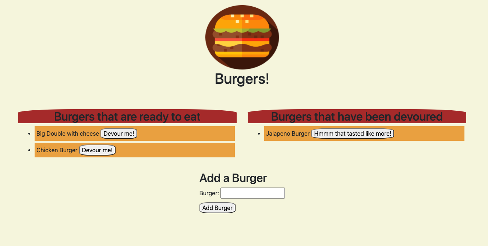

# Eat-Da-Burger

## Description
Created a burger logger that uses MySQL, Node, Express, Handlebars and a homemade ORM!

## Screenshot

## Table of Contents
* [Description](#Description)
* [Usage](#Usage)
* [License](#License)
* [Contributing](#Contributing)
* [Test](#Tests)
* [Questions](#Questions)

## Usage
Load the app through heroku, and use the submit a burger input to create your own burgers. User may then Devour burgers and regurgitate them for later!

## ILicense
MIT

## Contributing
Feel free to add some additional styling and functionality -- like creating a fine burger by using styling through inputs or a delete button to get rid of eaten burgers

## Testing
Run it through heroku and try to create your own burger. Once you hit 'add burger' it should show up in the list

## Questions
- [GitHub](https://github.com/CodyBonsma)
- [Email](codybonsma@gmail.com)